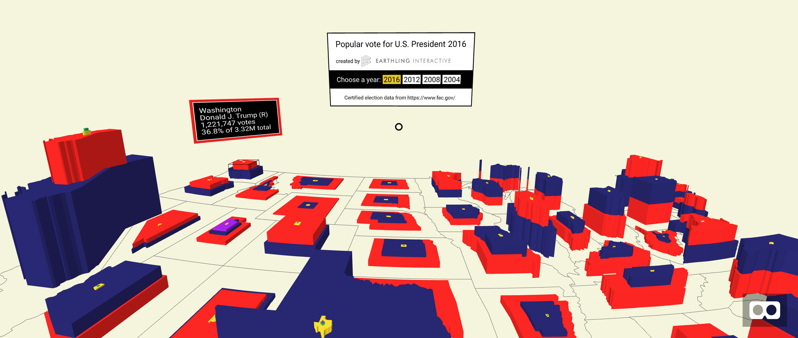

# Mapping the popular vote for US President in VR

The 2016 presidential election results show Donald Trump winning the electoral college but Hillary Clinton 
winning the popular vote.  The existing visualizations showing states or counties as red or blue provides 
information about the majority vote but they hide any sense of scale and they conceal the number of votes 
that non-majority candidates received.  For example, if one looks at the Google’s visualization of the 
Massachusetts voting results, all of the counties are blue and one would get the impression that no one voted 
for Donald Trump or any other candidate.  In fact, over one million people in Massachusetts voted for Donald Trump. 

The goal of this project is to build a visualization that leverages the 3D capabilities of virtual reality 
to show a more complete and nuanced view of voting results.

[](https://earthlinginteractive.github.io/election-vr/)

To view the project, go to: https://earthlinginteractive.github.io/election-vr/

The visualization can be viewed using the HTC Vive, Occulus Rift, Google Cardboard, or a Desktop browser.  The Vive and
the Rift support controller-based interactions to move and scale the map.

## About the data

The `data` subdirectory contains the source data files used in the visualization.  

The election data were downloaded from the [Federal Election Commission website](https://transition.fec.gov/pubrec/electionresults.shtml)
and processed using the `data/build-election-data-files.sh` script.

The map data were downloaded from [census.gov](https://census.gov) and processed using the `data/build-map-files.sh` script.

The FIPS code to state data is also from census.gov: http://www2.census.gov/geo/docs/reference/state.txt

These scripts provide a reproducible way to download and process the data files into the versions in `src/assets` that are used
directly in the visualization.  Note that the scripts must be run from within the `data` subdirectory.  They also
require several globally installed npm packages.  See the header of each file for details.

Finally, per the instructions on census.gov, I must state that "This product uses the Census Bureau Data API but is not endorsed or certified by the Census Bureau."

## Developing

### Pre-requisites

* [Node.js v8+](https://nodejs.org/en/)

### Running the project locally

```bash
npm install
npm start
```

### Releasing

The site is hosted on GitHub pages.  To release new changes:
```bash
npm run deploy
```
 
# Thanks
* To John Samuelson, Adam Simcock, Don Smith, Jared Chapiewsky, AJ Wortley, Linda Brudz, and Jake Brudz for their feedback, testing, and support
* To Earthling Interactive for their sponsorship
* To Kevin Ngo, Diego Marcos, Don McCurdy and many others at Mozilla and the community for creating the [A-Frame WebVR framework](https://aframe.io/)
* To Matthias Treitler for his [aframe-geojson-component](https://github.com/mattrei/aframe-geojson-component) which provided inspiration
and a starting point for how to display maps in VR
* To Will Murphy for his [super hands component](https://github.com/wmurphyrd/aframe-super-hands-component) which provides progressive support
and gestures for different types of controllers
* To Mike Bostock for creating d3.js and for his excellent series of articles on [command line cartography](https://medium.com/@mbostock/command-line-cartography-part-1-897aa8f8ca2c)

## Credits

Created by Steve Brudz with support and sponsorship from [Earthling Interactive](https://earthlinginteractive.com/)

[](https://earthlinginteractive.com/)
